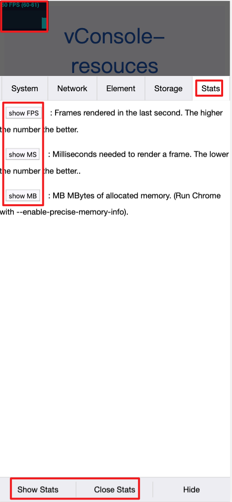

vconsole-stats-plugin
==============================
[](https://badge.fury.io/js/vconsole-stats-plugin)

A vConsole plugin which can show Stats in front-end.

Based on the [Stats https://github.com/mrdoob/stats.js](https://github.com/mrdoob/stats.js)


## Demo

[show demo](https://smackgg.github.io/vConsole-Stats/example/demo.html)


# Usage

Download the latest version(copy dist/vconsole-stats-plugin.min.js). See all demo code: [```/example/demo.html```](./example/demo.html)
```html
<script src="path/to/vconsole.min.js"></script>
<script src="path/to/vconsole-stats-plugin.min.js"></script>
<script>
  // init vConsole
  const vConsole = new VConsole();
  const plugin = new VConsole.VConsoleStatsPlugin(vConsole);
</script>
```

Or, install via npm:
```bash
npm install vconsole-stats-plugin -S
```
```js
import VConsole from 'vconsole';
import VConsoleStatsPlugin from 'vconsole-stats-plugin';
const vConsole = new VConsole();
const plugin = new VConsoleStatsPlugin(vConsole);
```

## Features
========

###stats.js

#### JavaScript Performance Monitor ####

This class provides a simple info box that will help you monitor your code performance.

* **FPS** Frames rendered in the last second. The higher the number the better.
* **MS** Milliseconds needed to render a frame. The lower the number the better.
* **MB** MBytes of allocated memory. (Run Chrome with `--enable-precise-memory-info`)
* **CUSTOM** User-defined panel support.


### Screenshots ###




- Show/Close Stats
- Change Stats Panel
